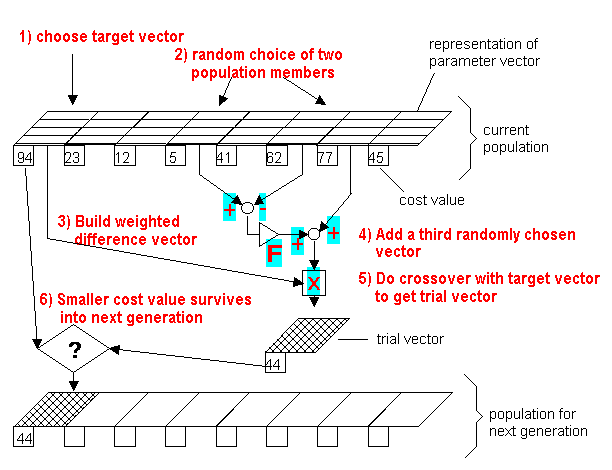
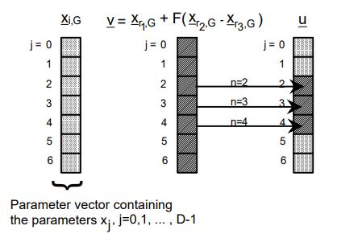

# Differential Evolution

Based on vector differences, is an **[evolutionary algorithm](https://en.wikipedia.org/wiki/Evolutionary_algorithm)** (not a genetic algorithm) to optimize a problem by iteratively trying to improve a candidate solution with regard to a given measure of quality. Such methods are commonly known as **metaheuristics** as they make few or *no assumptions about the optimized problem and can search very large spaces of candidate solutions*.
However, metaheuristics such as DE do not guarantee an optimal solution is ever found.

DE is a order 0 algorithm, which means that it does not use the gradient of the problem being optimized, the problem doesn't need to be, as is required by classic optimization methods such as gradient descent and quasi-newton methods. DE can therefore also be used on optimization problems that are not even continuous, are noisy, change over time, etc.

DE optimizes a problem by maintaining a population of candidate solutions and creating new candidate solutions by combining existing ones, and then keeping whichever candidate solution has the best score on the optimization problem at hand.

> Both genetic algorithms and differential evolution are examples of evolutionary computation.
> Genetic algorithms keep pretty closely to the metaphor of genetic reproduction.
> The first big change is that DE is using actual real numbers (in the strict mathematical sense-- they're implemented as floats, or doubles, or whatever, but in theory they're ranging over the field of reals) so nor binary or integer.
> As a result, the ideas of mutation and crossover are substantially different. The mutation operator is modified so far that it's hard for me to even see why it's called mutation, as such, except that it serves the same purpose of breaking things out of local minima.
> On the plus side, there are a handful of results showing DEs are often more effective and/or more efficient than genetic algorithms. And when working in numerical optimization, it's nice to be able to represent things as actual real numbers instead of having to work your way around to a chromosomal kind of representation.

## Perchè è stato scelto?
L'algoritmo **Differential Evolution (DE)** è generalmente particolarmente efficace per problemi non lineari, multidimensionali e con spazi di ricerca complessi. Viene spesso utilizzato per ottimizzare funzioni obiettivo difficili da derivare o con molteplici variabili

### Pro

1. **Robustezza per problemi complessi e non lineari**: 
    DE è progettato per lavorare bene con problemi di ottimizzazione che coinvolgono funzioni obiettivo non lineari e difficili da derivare. Poiché la configurazione dei satelliti e la relazione tra la posizione/velocità dei satelliti e la qualità della configurazione (calcolata tramite i "baselines" e il "fill factor") è altamente non lineare, DE è una scelta naturale.

2. **Flessibilità**:
   DE offre una buona flessibilità nella scelta di parametri come mutazione e i tassi di crossover, tipologia di variazione ed altri (vedi Extra: Others Mutation Strategy). Questi parametri sono tutto il necessario per variale l'aggressività nel esplorazione di esplorazione di nuove soluzioni.
   Esistono inoltre molti variazioni del algoritmo base che provano a variare dinamicamente le suddette strategie.

3. **Efficienza in spazi di ricerca ad alta dimensionalità**: 
    DE il metodo usato per generare nuovi "vettori" permette di esplorare spazi di ricerca ad alta dimensione con buone prestazioni.

### **Contro**

1. **Richiesta di molteplici valutazioni della funzione**:
   DE è un algoritmo basato su popolazioni, che esplora il problema generando nuove soluzioni a partire da soluzioni precedenti. Ogni iterazione comporta molte valutazioni della funzione obiettivo. Se la funzione di fitness (che calcola il "fill factor") è complessa o richiede molta potenza computazionale, il numero di valutazioni potrebbe diventare un problema significativo, aumentando i costi di calcolo.

2. **Lento nella convergenza fine**:
   Per ottenere una buona soluzione, può aver bisogno di molte generazioni, e quindi di molte valutazioni della funzione.

3. **Dipendenza dalla selezione dei parametri**:
   I parametri di DE, come la dimensione della popolazione, i tassi di mutazione e crossover, devono essere scelti con cura. La selezione di parametri errati potrebbe portare a una convergenza prematura (su una soluzione subottimale) o a una convergenza lenta.

### Riassumendo

Differential Evolution può essere una scelta potente per il problema di ottimizzazione che stai affrontando, specialmente per la sua capacità di navigare spazi di ricerca ad alta dimensione e di ottimizzare funzioni obiettivo non lineari. Tuttavia, l'algoritmo può presentare sfide legate alla lentezza della convergenza e alla necessità di molte valutazioni della funzione obiettivo, che potrebbero essere costose computazionalmente.

Se il problema è altamente complesso, l'algoritmo DE potrebbe richiedere ottimizzazioni iterative sui parametri e una buona gestione della popolazione per evitare la convergenza prematura. In generale, DE rappresenta una scelta robusta per ottimizzare la configurazione di una costellazione di satelliti, ma potrebbe essere necessario un attento bilanciamento delle risorse computazionali e dei parametri dell'algoritmo per ottenere i migliori risultati.

## Algorithm Explained

[src](https://sci-hub.ru/10.1023/a:1008202821328)

### 1-4) Mutazione

Per ogni vettore della popolazione $x_{i,G}$ viene costruito un vettore mutante $\boldsymbol{v}_{i,G+1}$ sulla base di una strategia di mutazione, facciamo 2 esempi:

**DE/best/1/bin**: prendiamo il vettore associato alla soluzione migliore $x_{best,G}$ e scegliamo casualmente dalla popolazione 1 + 1 vettori, il vettore candidato è dato da:
$$
  \boldsymbol{v}_{i,G+1}=\boldsymbol{x}_{best,G}+\lambda(\boldsymbol{x}_{i,G}-\boldsymbol{x}_{j,G}) \hspace{30pt}\text{con }i\neq j
$$
\in
**DE/best/2/bin**: prendiamo un vettore casualmente $x_{r,G}$ e scegliamo casualmente dalla popolazione altri 1 + 2 vettori, il vettore candidato è dato da:
$$
  \boldsymbol{v}_{i,G+1}=\boldsymbol{x}_{r,G}+\lambda(\boldsymbol{x}_{i,G}-\boldsymbol{x}_{j,G}-\boldsymbol{x}_{k,G}) \hspace{30pt}\text{con }i\neq j \neq \neq r
$$

dove $\lambda \in [0,2)$ è detto *mutazione* e rappresenta il "peso" che viene dato alla differenza dei vettori scelti casualmente.

> Nota! in quelli genetici la mutazione è invece generalmente: $x_{discendente}=x_{genitore}+\mathcal{v}(0,\sigma)$

### 4.9) Clipping

Il vettore mutante viene modificato in modo tale che ogni suo elemento si rispetti i vincoli di disuguaglianza lineare (bordi):
> Intendiamo con $u$ ed $l$ il vettore dei bound superiori ed inferiori

$$
\boldsymbol{v}_{i,G+1}=\begin{bmatrix}
v'_{i1}=\left\{
\begin{aligned}
&v_{i,mut1} \hspace{20pt} \text{se } l_{b1} \leq v_{i,mut1} \leq u_{v1}\\
&l_{b1} \hspace{36pt} \text{se } v_{i,mut1} <l_{b1}\\
&u_{b1} \hspace{34pt} \text{se } v_{i,mut1} > u_{b1}\\
\end{aligned}
\right. \\
v'_{i2}=\left\{
\begin{aligned}
&v_{i,mut2} \hspace{20pt} \text{se } l_{v2} \leq b_{i,mut2} \leq u_{b2}\\
&l_{b2} \hspace{36pt} \text{se } v_{i,mut2} <l_{b2}\\
&u_{b2} \hspace{34pt} \text{se } v_{i,mut2} > u_{b2}\\
\end{aligned}
\right. \\
\vdots \\
\end{bmatrix}
$$

### 5) Crossover

A questo punto, viene costruito il vettore candidato $\hat{\boldsymbol{v}}_i$ scegliendo i parametri da $x_{i,G}$ o da $\boldsymbol{v}'_{i,G+1}$ con la seguente strategia:

Il cambio avviene sulla base di $CR$ arbitrario, generalmente 0.7
Per ogni elemento del vettore viene calcolato un numero casuale:

- se $rand.rand() \le CR$ il $j$-esimo elemento del nuovo viene preso da quello quello di $\boldsymbol{v}'_{i,G+1}$
- se $rand.rand() > CR$ il gene $i$-esimo gene rimane quello di $\boldsymbol{x}_{i,G}$

In questo modo $\hat{\boldsymbol{v}}_{i,G+1}$ viene formato

### 6)Selection

A questo punto per decidere se $\hat{\boldsymbol{v}}_{i,G+1}$ farà parte della nuova popolazione oppure no, si confronta con $x_{i,G}$ mediante la fitness, chi la soddisfa maggiormente entra a far parte della popolazione della generazione $G+1$:
$$
\boldsymbol{x}_{i,G+1} = \left\{
\begin{align*}
  &\hat{\boldsymbol{v}}_{i,G+1} \hspace{30pt} \text{se } F(\hat{\boldsymbol{v}}_{i,G+1})<F(\boldsymbol{x}_{i,G})\\
  &\boldsymbol{x}_{i,G}\hspace{30pt} \text{altrimenti}
\end{align*}
\right.
$$

> nei problemi di minimizzazione

## Scipy Variant [doc](https://docs.scipy.org/doc/scipy/reference/generated/scipy.optimize.differential_evolution.html)

Questa libs implementa una versione del algoritmo dove $\lambda$ viene modificato, in un range (min, max) sulla base di come sta migliorando la soluzione con l'avanzare delle generazioni:

- **Mutation**: In the literature this is also known as *differential weight*, being denoted by $\lambda$. In this implementation it can have a (min, max) because *dithering* is employed. Dithering randomly changes the mutation constant on a generation *by generation basis*. The mutation constant for that generation is taken from U\[min, max\). Dithering can help speed convergence significantly. Increasing the mutation constant increases the search radius, but will slow down convergence.
- **Recombination** is $CR$

## Extra: Others Mutation Strategy

In order to classify the different variants and strategy, the notation **DE/x/y/z** is used:

- x = best | rand
- y = 1 | 2 | 3
- z = bin | exp

### x. Current

The **Base Individual** defines which individual in the population will be used to guide the mutation process.

| **Base Individual** | **Description**                                                                                                            |
| ------------------- | -------------------------------------------------------------------------------------------------------------------------- |
| **best**            | The individual with the best fitness value in the current population. It is used to exploit the current optimal solutions. |
| **rand**            | A randomly chosen individual from the population. It is used to introduce diversity and explore the search space.          |

> The **current individual** refers to the candidate solution that is currently being processed or mutated in a given iteration of the Differential Evolution (DE) algorithm.

### y. Number of Random Individuals

This attribute defines how many random individuals are used to compute the difference vectors that form the mutation process. Increasing the number of random individuals allows the algorithm to explore a broader solution space, improving diversity but possibly reducing exploitation.

| Number of Random Individuals | Description                                                                                                                                                                            |
| ---------------------------- | -------------------------------------------------------------------------------------------------------------------------------------------------------------------------------------- |
| **1**                        | The mutation is done using just one random individual. This is a basic mutation strategy, introducing minimal diversity.                                                               |
| **2**                        | Two random individuals are used to generate the mutation, introducing more diversity and exploration. This increases the chances of exploring different regions of the solution space. |
| **3**                        | Three random individuals are involved in the mutation process. This introduces even more exploration and variability in the mutation, enhancing global search capabilities.            |
| ...                          |                                                                                                                                                                                        |

### z. Crossover Type

The **Crossover Type** defines how the mutated individual is combined with the base individual to form the next candidate solution (or offspring). The two primary crossover methods in DE are **Exponential (exp)** and **Binomial (bin)**, and they differ in how they combine the solution vectors.

| Crossover Type   | Description                                                                                                                                                                                                                                                                                                                        |
| ---------------- | ---------------------------------------------------------------------------------------------------------------------------------------------------------------------------------------------------------------------------------------------------------------------------------------------------------------------------------- |
| bin(Binomial)    | works by *independently deciding for each dimension of the individual* whether it will come from the base individual or the mutated individual. The decision is based on a fixed probability. This tends to result in **more conservative changes**, focusing on refining the solution instead of exploring drastically new areas. |
| exp(Exponential) | involves combining the base and mutated individuals across several dimensions. The offspring is created by *progressively swapping parts of the target vector with the mutant vector*. This crossover typically leads to **more aggressive changes** and is suited for exploring new areas.                                        |
